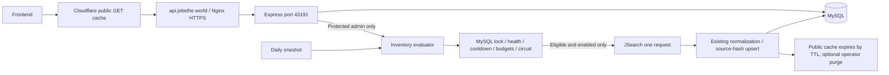

# Internal backend and inventory architecture

Public requests never enter the evaluator. Cache hits and misses have no effect on inventory decisions. GET admin status updates inventory counts but cannot call upstream. Admin refresh and the scheduler share the same global MySQL lock, persisted reservations and budget gates.

The evaluator processes the four priority countries × twenty categories, ranks deficient buckets by usable count, fresh count and oldest successful refresh, and admits at most the remaining daily capacity. Zero usable sorts first naturally. Default upstream execution is disabled. One HTTP request requests one page; no Job Details fanout or retries occur. The 160-request total monthly cap contains the 40-request admin reserve and leaves forty requests below the known 200-request plan limit. Provider billing periods and other clients must be reconciled manually before activation.

The additive migration creates job_inventory_buckets, job_refresh_audit, jsearch_request_budgets and jsearch_refresh_state. It neither changes jobs nor backfills them. Reliable expiry is unverified, so active=1 is the usable definition. Old records retain the existing stale/removal behavior. No expiry column, raw-payload expiry inference, deletion, or cleanup schedule change is introduced.

A reserved audit is durable before the request. A crash may leave a reserved audit without a completion timestamp; the request remains charged. The connection lock is released on disconnect, while a fifteen-minute bucket lease and twelve-hour cooldown survive. Global spacing survives restarts. All new accounting timestamps use UTC; existing posted_at timezone requires a deployment check.

A 429 persistently blocks subsequent work and stops the current run. Safe reset/quota headers are recorded for operator diagnosis. No automatic clearing is implemented because reset timestamps and plan semantics are not verified. If writing a breaker fails, the evaluator aborts and makes no further request in that process; persistent budget reservation still protects accounting.

No production DNS, Nginx, TLS, Worker branch or service configuration is changed by this repository implementation. The systemd files are examples only. The migration and inventory commands must be invoked deliberately. Public and internal API specifications are independent documents with disjoint route/schema sets.
